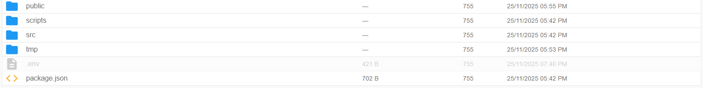
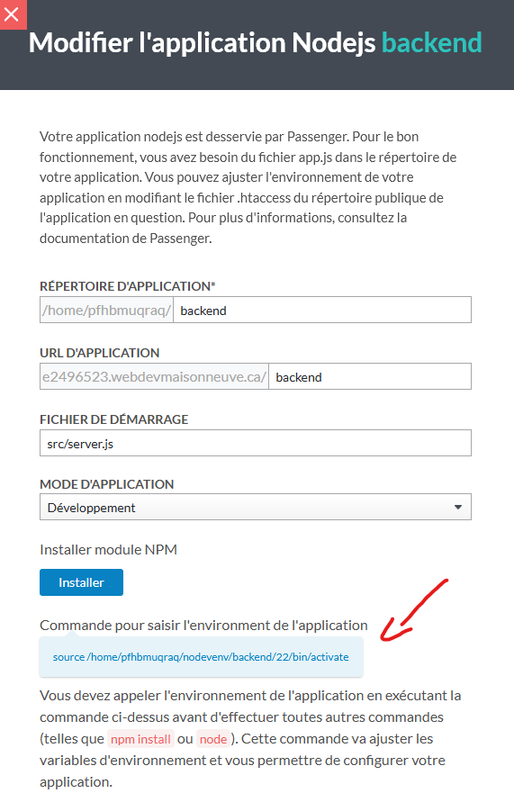
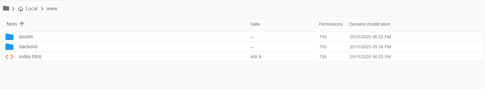
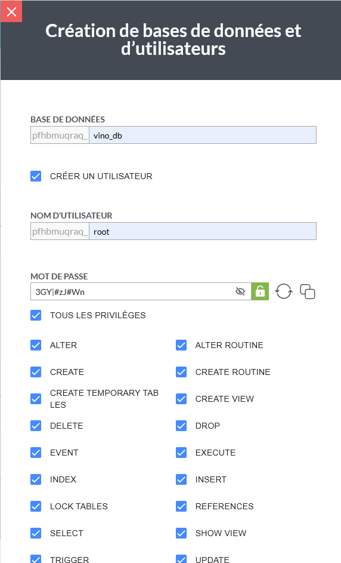
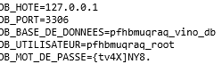
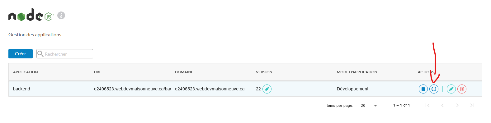

# Création de l’application Node.js dans N0C

Dans le tableau de bord N0C, allez dans **Langages > Node.js**. L’interface liste vos applications Node.js existantes.

1. Cliquez sur **Créer** pour définir une nouvelle application Node.js.
2. Dans le formulaire :
   - Choisissez la version la plus récente de Node.js.
   - Indiquez le répertoire d’application `backend` — dossier où seront placés les fichiers du backend.
   - Indiquez le Domaine/URL d’application `/backend` si vous voulez accéder à `https://<votre-domaine>/backend` (ex. `https://e1234567.webdevmaisonneuve.ca/backend`).
   - Spécifiez le fichier de démarrage `src/server.js`.
   - Spécifiez le mode d'application pour Développement.
3. Cliquez sur **Créer**.

Un dossier `/home/<votre_user>/<répertoire_app>` est alors créé. Vérifiez sa présence dans le gestionnaire de fichiers N0C (Onglet Fichiers) et testez l’application en naviguant vers `https://votre-domaine/<répertoire_app>` (la page affiche « It works ! » par défaut).

## 2. Téléversement du backend Node.js

Dans **Fichiers > Gestionnaire de fichiers** Ouvrez le Gestionnaire de fichiers N0C et placer dans `Local > Backend` les dossiers `scripts, src, .env et package.json`


## 3. Configuration et démarrage de l’application Node.js

1. Dans **Langages > Node.js**, repérez l’application créée et cliquez sur l’icône **Modifier**.
2. **Copier** La commande pour saisir l'environnement de l'application
   
3. Dans **Fichiers > Terminal** Exécutez la commande `cd backend`
4. **Coller** La source de l'environnement de l'application
5. **Exécuter** La commande npm install afin d'installer les dépendances
6. **Lancer** Le serveur avec la commande `npm run dev`

## 4. Compilation et déploiement du frontend React

1. Dans **VSCode** **Exécuter** cette comamnde dans le répertoire Frontend `npm run build`
2. **Copier** le contenu de **Dist** dans **Fichiers > Gestionnaire de fichiers > Local > www**
   

## 5. Création de la base de données MySQL

1. Dans **Bases de données > MySQL** Appuyer sur le bouton **Créer** une base de données
2. Dans le formulaire :
   - **Écrivez** le nom de la base de données (vino_db).
   - **Cochez** la case Créer un utilisateur.
   - **Écrivez** root dans le champs nom d'utilisateur.
   - **Générez** un mot de passe, **Copiez** le et mettez le en lieu sûr.
3. **Cliquez** sur **Créer**
   

## 6. Configuration de la connexion MySQL dans le backend

1. Dans **Fichiers > Gestionnaire de fichiers > Local > Backend** **Ouvrez** le fichier `.env`
2. **Changez** les configurations de la base de données pour ceux-ci

```env
DB_HOTE=127.0.0.1
DB_PORT=3306
DB_BASE_DE_DONNEES=ton_nom_utilisateur_vino_db
DB_UTILISATEUR=ton_nom_utilisateur_root
DB_MOT_DE_PASSE=mot_de_passe_generez
```

### Voici un exemple



## Configuration terminé

### Redémarrarer l'application



1. **Le Serveur se lance avec la commande `npm run dev`** _Voir Étape 3_
2. **Le FrontEnd changera à chaque `npm run build`** _Voir Étape 4_
3. **Tout ajout, retrait ou modification nécessitera une réimportation de ce fichier** _Voir Étape 2_

## Bug To Fix


